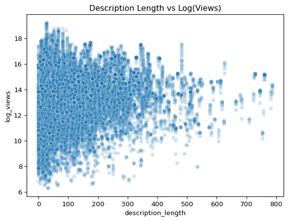
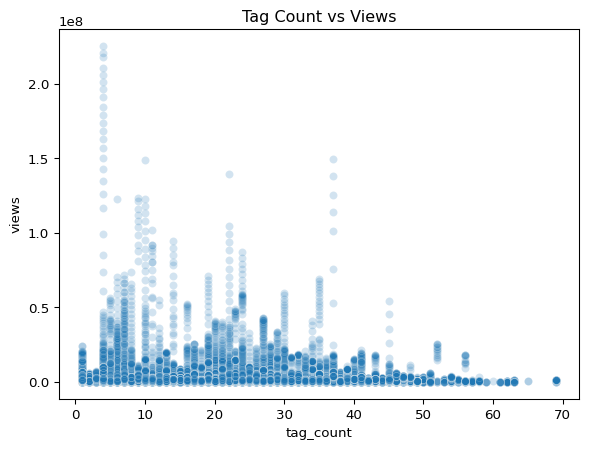
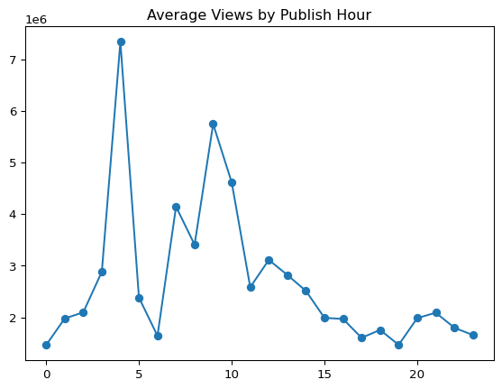
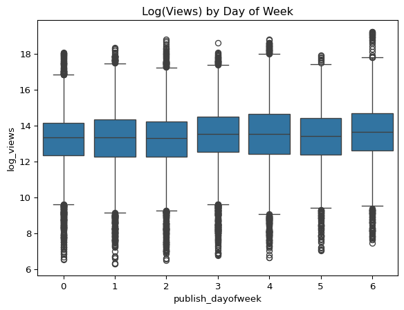
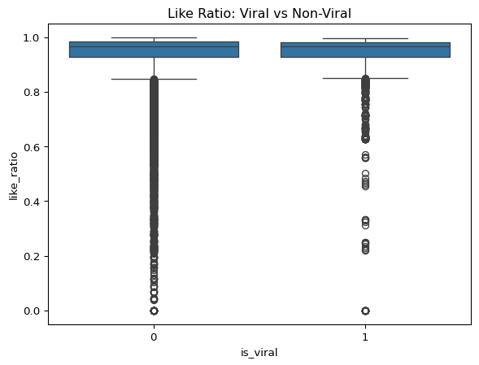

# The Smart Creator Strategy: What Actually Drives YouTube Views?


## The Project

I used to believe that success on YouTube came from effort — longer
descriptions, more tags, carefully written titles.  
But after watching my own views hit rock bottom, I turned to data to
understand what I had been doing wrong.

This project analyzes thousands of U.S. trending YouTube videos to
answer a simple but important question:

**Does working harder actually help creators succeed, or is the game
fundamentally different from what we think?**

By analyzing text features, upload timing, and engagement patterns, I
uncovered three surprising insights:

1.  Effort-based features (tags, description length, title length)
    barely matter.  
2.  Timing is one of the most powerful and misunderstood levers.  
3.  Viral videos have specific linguistic and behavioral signatures.

The results reshaped how I understand online attention — and what
creators should actually focus on.

------------------------------------------------------------------------

## The Data

The dataset comes from the Kaggle Trending YouTube Video Statistics
collection.  
It includes:

- video titles, descriptions, and tags  
- view, like, and dislike counts  
- upload time and trending metadata  
- category IDs and video identifiers

This dataset allowed me to test common creator beliefs using real data.

------------------------------------------------------------------------

## Getting Started

### Importing Libraries and Loading Data

``` python
import pandas as pd
import numpy as np
import seaborn as sns
import matplotlib.pyplot as plt
import statsmodels.api as sm
import re
from scipy.stats import ttest_ind

video = pd.read_csv('USvideos.csv')
```

### Initial Inspection

``` python
video.head()
video.info()
video.describe(include='all')
video.isna().sum()
```

    <class 'pandas.core.frame.DataFrame'>
    RangeIndex: 40949 entries, 0 to 40948
    Data columns (total 16 columns):
     #   Column                  Non-Null Count  Dtype 
    ---  ------                  --------------  ----- 
     0   video_id                40949 non-null  object
     1   trending_date           40949 non-null  object
     2   title                   40949 non-null  object
     3   channel_title           40949 non-null  object
     4   category_id             40949 non-null  int64 
     5   publish_time            40949 non-null  object
     6   tags                    40949 non-null  object
     7   views                   40949 non-null  int64 
     8   likes                   40949 non-null  int64 
     9   dislikes                40949 non-null  int64 
     10  comment_count           40949 non-null  int64 
     11  thumbnail_link          40949 non-null  object
     12  comments_disabled       40949 non-null  bool  
     13  ratings_disabled        40949 non-null  bool  
     14  video_error_or_removed  40949 non-null  bool  
     15  description             40379 non-null  object
    dtypes: bool(3), int64(5), object(8)
    memory usage: 4.2+ MB

    video_id                    0
    trending_date               0
    title                       0
    channel_title               0
    category_id                 0
    publish_time                0
    tags                        0
    views                       0
    likes                       0
    dislikes                    0
    comment_count               0
    thumbnail_link              0
    comments_disabled           0
    ratings_disabled            0
    video_error_or_removed      0
    description               570
    dtype: int64

------------------------------------------------------------------------

# Question 1

## Do effort-based features (long descriptions, more tags, longer titles) increase views?\*\*

Creators are often told that they must “work harder”:

- Write longer descriptions
- Add more tags
- Craft longer titles

To test this myth, I first cleaned the text fields.

------------------------------------------------------------------------

### Text Cleaning Pipeline

``` python
video['description'] = video['description'].fillna("")

video['title_clean'] = video['title'].str.lower()
video['description_clean'] = video['description'].str.lower()

# Remove URLs
video['title_clean'] = video['title_clean'].str.replace(r'http\S+|www\S+', '', regex=True)
video['description_clean'] = video['description_clean'].str.replace(r'http\S+|www\S+', '', regex=True)

# Remove special characters
video['title_clean'] = video['title_clean'].str.replace(r'[^\w\s]', '', regex=True)
video['description_clean'] = video['description_clean'].str.replace(r'[^\w\s]', '', regex=True)

# Normalize whitespace
video['title_clean'] = video['title_clean'].str.replace(r'\s+', ' ', regex=True).str.strip()
video['description_clean'] = video['description_clean'].str.replace(r'\s+', ' ', regex=True).str.strip()
```

### Description Length

``` python
video['description_length'] = video['description_clean'].apply(lambda x: len(x.split()))
video['description_length'].describe()
```

    count    40949.000000
    mean       105.266380
    std        101.393106
    min          0.000000
    25%         34.000000
    50%         76.000000
    75%        139.000000
    max        786.000000
    Name: description_length, dtype: float64

### Views Distribution

Raw views are extremely skewed — so I used log-transform.

``` python
video['log_views'] = np.log1p(video['views'])
```

------------------------------------------------------------------------

### Description Length vs Views

``` python
sns.scatterplot(data=video, x='description_length', y='log_views', alpha=0.2)
plt.title("Description Length vs Log(Views)")
plt.show()
```



### Regression: Does description length matter?

``` python
X1 = sm.add_constant(video[['description_length']])
model1 = sm.OLS(video['log_views'], X1).fit()
model1.summary()
```

|                   |                  |                     |           |
|-------------------|------------------|---------------------|-----------|
| Dep. Variable:    | log_views        | R-squared:          | 0.003     |
| Model:            | OLS              | Adj. R-squared:     | 0.003     |
| Method:           | Least Squares    | F-statistic:        | 112.2     |
| Date:             | Wed, 10 Dec 2025 | Prob (F-statistic): | 3.52e-26  |
| Time:             | 23:21:11         | Log-Likelihood:     | -80016.   |
| No. Observations: | 40949            | AIC:                | 1.600e+05 |
| Df Residuals:     | 40947            | BIC:                | 1.601e+05 |
| Df Model:         | 1                |                     |           |
| Covariance Type:  | nonrobust        |                     |           |

OLS Regression Results

|                    |         |          |          |          |         |         |
|--------------------|---------|----------|----------|----------|---------|---------|
|                    | coef    | std err  | t        | P\>\|t\| | \[0.025 | 0.975\] |
| const              | 13.2452 | 0.012    | 1088.841 | 0.000    | 13.221  | 13.269  |
| description_length | 0.0009  | 8.32e-05 | 10.592   | 0.000    | 0.001   | 0.001   |

|                |          |                   |          |
|----------------|----------|-------------------|----------|
| Omnibus:       | 1547.598 | Durbin-Watson:    | 1.491    |
| Prob(Omnibus): | 0.000    | Jarque-Bera (JB): | 2175.717 |
| Skew:          | -0.385   | Prob(JB):         | 0.00     |
| Kurtosis:      | 3.826    | Cond. No.         | 211\.    |

<br/><br/>Notes:<br/>[1] Standard Errors assume that the covariance matrix of the errors is correctly specified.

**Result:** The coefficient is tiny. Longer descriptions do NOT help.

------------------------------------------------------------------------

### Tags and Views

``` python
video['tags_clean'] = video['tags'].replace('[none]', '')
video['tag_list'] = video['tags_clean'].str.split('|')
video['tag_count'] = video['tag_list'].apply(len)

sns.scatterplot(data=video, x='tag_count', y='views', alpha=0.2)
plt.title("Tag Count vs Views")
plt.show()

X2 = sm.add_constant(video[['tag_count']])
model2 = sm.OLS(video['log_views'], X2).fit()
model2.summary()
```



|                   |                  |                     |           |
|-------------------|------------------|---------------------|-----------|
| Dep. Variable:    | log_views        | R-squared:          | 0.008     |
| Model:            | OLS              | Adj. R-squared:     | 0.008     |
| Method:           | Least Squares    | F-statistic:        | 313.2     |
| Date:             | Wed, 10 Dec 2025 | Prob (F-statistic): | 7.81e-70  |
| Time:             | 23:21:11         | Log-Likelihood:     | -79916.   |
| No. Observations: | 40949            | AIC:                | 1.598e+05 |
| Df Residuals:     | 40947            | BIC:                | 1.599e+05 |
| Df Model:         | 1                |                     |           |
| Covariance Type:  | nonrobust        |                     |           |

OLS Regression Results

|           |         |         |         |          |         |         |
|-----------|---------|---------|---------|----------|---------|---------|
|           | coef    | std err | t       | P\>\|t\| | \[0.025 | 0.975\] |
| const     | 13.0932 | 0.016   | 808.641 | 0.000    | 13.061  | 13.125  |
| tag_count | 0.0124  | 0.001   | 17.699  | 0.000    | 0.011   | 0.014   |

|                |          |                   |          |
|----------------|----------|-------------------|----------|
| Omnibus:       | 1367.088 | Durbin-Watson:    | 1.495    |
| Prob(Omnibus): | 0.000    | Jarque-Bera (JB): | 1933.832 |
| Skew:          | -0.350   | Prob(JB):         | 0.00     |
| Kurtosis:      | 3.802    | Cond. No.         | 44.5     |

<br/><br/>Notes:<br/>[1] Standard Errors assume that the covariance matrix of the errors is correctly specified.

**Result:** More tags ≠ more views. Another myth debunked.

------------------------------------------------------------------------

# Question 2

## **Does upload timing influence visibility — and can creators exploit it?**

After finding that “effort metrics” don’t matter, I tested a different
variable:

**Time.**

### Convert to Datetime

``` python
video['publish_time'] = video['publish_time'].astype(str).str.replace('"','')
video['publish_time'] = pd.to_datetime(video['publish_time'], errors='coerce')
```

### Hourly Patterns

``` python
video['publish_hour'] = video['publish_time'].dt.hour
hour_views = video.groupby('publish_hour')['views'].mean()

plt.plot(hour_views.index, hour_views.values, marker='o')
plt.title("Average Views by Publish Hour")
plt.show()
```



**Insight:** Views spike at 4 AM and again between 7–9 AM.

------------------------------------------------------------------------

### Weekly Patterns

``` python
video['publish_dayofweek'] = video['publish_time'].dt.dayofweek

sns.boxplot(data=video, x='publish_dayofweek', y='log_views')
plt.title("Log(Views) by Day of Week")
plt.show()
```



### Weekend Indicator

``` python
video['is_weekend'] = video['publish_dayofweek'].apply(lambda x: 1 if x >= 5 else 0)
```

------------------------------------------------------------------------

### Supply vs Demand (Blue Ocean Strategy)

Supply: When creators upload Demand:When viewers watch

``` python
supply = video.groupby('is_weekend')['video_id'].count()
demand = video.groupby('is_weekend')['log_views'].mean()
```

Creators upload more on weekdays, but **demand actually peaks on
weekends — especially Sunday**.

### T-test: Is Sunday significantly better?

``` python
sunday_views = video[video['publish_dayofweek']==6]['log_views']
weekday_views = video[video['publish_dayofweek']<=4]['log_views']

t_stat, p_value = ttest_ind(sunday_views, weekday_views, equal_var=False)
t_stat, p_value
```

    (np.float64(8.306182010964168), np.float64(1.2836428547253138e-16))

**Finding:** Sunday view counts are significantly higher, despite lower
competition. This is the Blue Ocean posting window.

------------------------------------------------------------------------

# Question 3

## **What features distinguish viral videos from ordinary ones?**

### Define Viral (Top 10%)

``` python
viral_threshold = video['views'].quantile(0.90)
video['is_viral'] = (video['views'] >= viral_threshold).astype(int)
```

------------------------------------------------------------------------

### Title Length and Like Ratio

``` python
video['title_length'] = video['title_clean'].str.len()
video['like_ratio'] = video['likes'] / (video['likes'] + video['dislikes'] + 1)

sns.boxplot(data=video, x='is_viral', y='like_ratio')
plt.title("Like Ratio: Viral vs Non-Viral")
plt.show()
```



**Engagement quality is a strong viral signal.**

------------------------------------------------------------------------

### ALL CAPS Titles

``` python
def is_all_caps(text):
    letters = re.sub(r'[^A-Za-z]', '', text)
    return int(letters.isupper()) if len(letters)>0 else 0

video['is_all_caps'] = video['title'].apply(is_all_caps)

caps = video[video['is_all_caps']==1]['log_views']
normal = video[video['is_all_caps']==0]['log_views']

ttest_ind(caps, normal, equal_var=False)
```

    TtestResult(statistic=np.float64(7.244090627846116), pvalue=np.float64(5.401916347275739e-13), df=np.float64(3276.614328788032))

**Finding:** ALL CAPS titles perform significantly better.

------------------------------------------------------------------------

### Keyword Analysis (Which words make videos go viral?)

``` python
video['title_words'] = video['title_clean'].str.split()
words_df = video[['video_id', 'is_viral', 'title_words']].explode('title_words')

stopwords = set(['the','a','an','to','of','and','or','for','in','on','with','at','by','is','are','be','this','that'])
words_df = words_df[~words_df['title_words'].isin(stopwords)]

keyword_stats = (
    words_df.groupby('title_words')
            .agg(total_count=('video_id','count'),
                 viral_count=('is_viral','sum'))
)

keyword_stats['viral_rate'] = keyword_stats['viral_count'] / keyword_stats['total_count']
keyword_stats = keyword_stats[keyword_stats['total_count'] >= 50]
keyword_stats.sort_values('viral_rate', ascending=False).head(30)
```

<div>
<style scoped>
    .dataframe tbody tr th:only-of-type {
        vertical-align: middle;
    }
&#10;    .dataframe tbody tr th {
        vertical-align: top;
    }
&#10;    .dataframe thead th {
        text-align: right;
    }
</style>

|              | total_count | viral_count | viral_rate |
|--------------|-------------|-------------|------------|
| title_words  |             |             |            |
| shots        | 58          | 51          | 0.879310   |
| robin        | 55          | 47          | 0.854545   |
| dude         | 143         | 118         | 0.825175   |
| ralph        | 56          | 46          | 0.821429   |
| balvin       | 54          | 44          | 0.814815   |
| 방탄소년단   | 99          | 80          | 0.808081   |
| mv           | 245         | 190         | 0.775510   |
| spider       | 132         | 101         | 0.765152   |
| lopez        | 72          | 54          | 0.750000   |
| jay          | 62          | 46          | 0.741935   |
| chunli       | 58          | 42          | 0.724138   |
| diplo        | 85          | 61          | 0.717647   |
| 45m          | 60          | 43          | 0.716667   |
| chainsmokers | 54          | 38          | 0.703704   |
| kingdom      | 53          | 37          | 0.698113   |
| lucas        | 78          | 54          | 0.692308   |
| lipa         | 55          | 38          | 0.690909   |
| dua          | 55          | 38          | 0.690909   |
| daddy        | 54          | 37          | 0.685185   |
| duty         | 53          | 36          | 0.679245   |
| hey          | 65          | 43          | 0.661538   |
| incredibles  | 64          | 39          | 0.609375   |
| royale       | 86          | 52          | 0.604651   |
| paramount    | 69          | 41          | 0.594203   |
| j            | 134         | 79          | 0.589552   |
| minaj        | 90          | 53          | 0.588889   |
| jurassic     | 77          | 45          | 0.584416   |
| fortnite     | 118         | 68          | 0.576271   |
| montana      | 70          | 40          | 0.571429   |
| deadpool     | 100         | 57          | 0.570000   |

</div>

**Specific, high-signal keywords (e.g., “official”, “game”, “star”)
strongly predict virality.**

Generic words do not.

------------------------------------------------------------------------

# Discussion and Takeaways

Across thousands of videos, the data reveals:

### Effort ≠ Succes

Long descriptions, many tags, long titles — none significantly improve
visibility.

### Timing is a competitive advantage

Creators overwhelmingly post on weekdays, while Sunday has the highest
average views with less competition.

### Viral videos have clear linguistic signals

ALL CAPS titles Specific keywords High engagement ratios

## These features consistently separate viral content from everything else.z

# Future Work

If extended, this project could evolve into a much deeper analytics
system. I would build a full viral-prediction model, incorporate
image-recognition techniques to analyze thumbnails. I would also compare
country-level patterns across global datasets and explore creator-level
behavioral trends to understand how posting habits influence
performance. Ultimately, understanding the mechanics behind attention
helps creators stop wasting effort.
